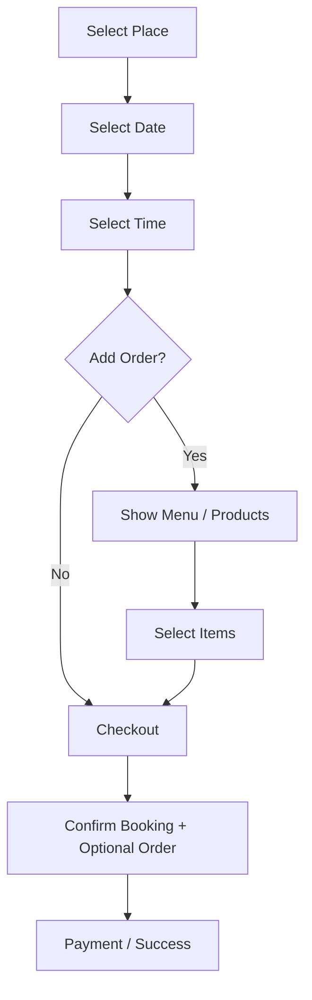

# Client App Plan — Angular SSR + Capacitor

## Tech Stack

| Concern | Choice |
|---------|--------|
| Framework | Angular (SSR enabled) |
| Styling | Tailwind CSS |
| Components | PrimeNG (Aura theme) |
| Mobile | Capacitor (Android + iOS) |
| State | Angular signals + services (NgRx only if needed) |
| HTTP | Angular `HttpClient` with interceptors for auth |

The client app (`apps/client-app`) is the **public-facing customer application**. It must perform well on web and be packageable as a native mobile app through Capacitor.

---

## Screens and Routes

```
/                         → Home (categories, nearby, recommended, search)
/category/:slug           → Category listing (restaurants, barbers, etc.)
/place/:id                → Place details (images, info, times, menu, reviews)
/booking                  → Booking flow (multi-step)
  /booking/select-date
  /booking/select-time
  /booking/add-order       (optional step)
  /booking/confirm
/checkout                 → Payment + final confirmation
/orders                   → Orders and bookings history
/orders/:id               → Order/booking detail
/profile                  → Customer account profile
/profile/edit
/notifications            → Notification list
/auth/login
/auth/register
```

Auth routes (`/auth/*`) must be excluded from SSR pre-rendering (they are always client-rendered).

---

## Booking Flow



---

## Lib Structure

Feature code does **not** live inside `apps/client-app/src/app` directly. It is split into libs under `libs/user/` (customer domain) so it is reusable, testable in isolation, and enforced by Nx boundaries.

### Libs to create (in build order)

| Lib | Import path | Purpose |
|-----|-------------|---------|
| `libs/user/data-access` | `@nexo/user/data-access` | HTTP services, API calls, auth token handling |
| `libs/user/feature-home` | `@nexo/user/feature-home` | Home page, category grid, nearby places |
| `libs/user/feature-booking` | `@nexo/user/feature-booking` | Full booking flow (multi-step) + optional order step |
| `libs/user/feature-orders` | `@nexo/user/feature-orders` | Order history, booking history, detail view |
| `libs/user/feature-profile` | `@nexo/user/feature-profile` | Profile, edit, notifications |

Each feature lib has its own route that is **lazy-loaded** from the app shell router.

### Generate a lib

```bash
npx nx g @nx/angular:library \
  --name=data-access \
  --directory=libs/user/data-access \
  --importPath=@nexo/user/data-access \
  --buildable=false \
  --style=css
```

---

## App Shell (`apps/client-app`)

The app shell stays thin. Its job is:
- Bootstrap providers (PrimeNG, animations, SSR hydration)
- Define the top-level router with lazy-loaded feature routes
- Render the layout shell (nav bar, bottom tab bar for mobile)

```typescript
// apps/client-app/src/app/app.routes.ts
export const appRoutes: Routes = [
  { path: '', loadChildren: () => import('@nexo/user/feature-home').then(m => m.USER_HOME_ROUTES) },
  { path: 'booking', loadChildren: () => import('@nexo/user/feature-booking').then(m => m.USER_BOOKING_ROUTES) },
  { path: 'orders', loadChildren: () => import('@nexo/user/feature-orders').then(m => m.USER_ORDERS_ROUTES) },
  { path: 'profile', loadChildren: () => import('@nexo/user/feature-profile').then(m => m.USER_PROFILE_ROUTES) },
  { path: 'auth', loadChildren: () => import('@nexo/user/feature-auth').then(m => m.USER_AUTH_ROUTES) },
];
```

`USER_*` route export names are for the **customer** domain (consumed by client-app); they do not refer to the old `user-app` project name.

---

## State Management

Start with **Angular signals + services** only. Do not add NgRx until you can point to a concrete problem it solves.

| Concern | Approach |
|---------|---------|
| Auth token / signed-in customer | Signal in `AuthService` (from `data-access`) |
| Booking multi-step state | Signal or service in `feature-booking` |
| Cart / selected items | Service in `feature-booking` |
| Notifications count | Signal in `NotificationsService` |

If booking/cart state gets complex across routes, NgRx Signals Store is the modern Angular choice (lighter than classic NgRx).

---

## SSR Notes

Angular SSR runs on a Node server (Express). Not everything should be rendered on the server.

| Route type | Rendering |
|-----------|-----------|
| Home, category, place details | SSR (good for SEO and first paint) |
| Booking flow | Client-rendered (complex state, no SEO value) |
| Orders, profile | Client-rendered (auth-gated, no SEO value) |
| Auth pages | Client-rendered (always excluded from pre-render) |

Mark client-only routes in `app.routes.server.ts`:

```typescript
export const serverRoutes: ServerRoute[] = [
  { path: 'auth/**', renderMode: RenderMode.Client },
  { path: 'booking/**', renderMode: RenderMode.Client },
  { path: 'orders/**', renderMode: RenderMode.Client },
  { path: 'profile/**', renderMode: RenderMode.Client },
  { path: '**', renderMode: RenderMode.Server },
];
```

---

## Capacitor (Mobile)

`apps/client-app/capacitor.config.ts` is already present:

```typescript
const config: CapacitorConfig = {
  appId: 'com.nexo.user',
  appName: 'Nexo Client',
  webDir: '../../dist/apps/client-app/browser',
};
```

### Next steps (after first real build)

```bash
# from apps/client-app
npx cap add android
npx cap add ios

# after each build
npm run cap:sync:client   # runs: nx build client-app && cap sync
```

Native platform folders (`android/`, `ios/`) are gitignored for build artifacts but the source config is tracked.

Capacitor plugins to add when you need device features:
- `@capacitor/push-notifications` — for booking/order alerts
- `@capacitor/geolocation` — for "nearby places"
- `@capacitor/camera` — for profile photo upload

---

## Delivery Phases (Client App)

### Phase 1 — Foundation
- App shell with routing, PrimeNG, Tailwind wired (done)
- Auth screens (login, register) connected to API
- `libs/user/data-access` created with `AuthService`, `HttpClient` interceptor for token

### Phase 2 — Browse
- `libs/user/feature-home`: home screen, category grid, place cards
- `libs/user/feature-booking` stub: place details screen, available slots

### Phase 3 — Booking
- Full booking multi-step flow
- Optional order step with product selection
- Checkout and confirmation screen

### Phase 4 — Account
- `libs/user/feature-orders`: history, detail view, status tracking
- `libs/user/feature-profile`: profile edit, notifications list

### Phase 5 — Mobile
- Capacitor add Android + iOS
- Push notifications
- Geolocation for nearby places
