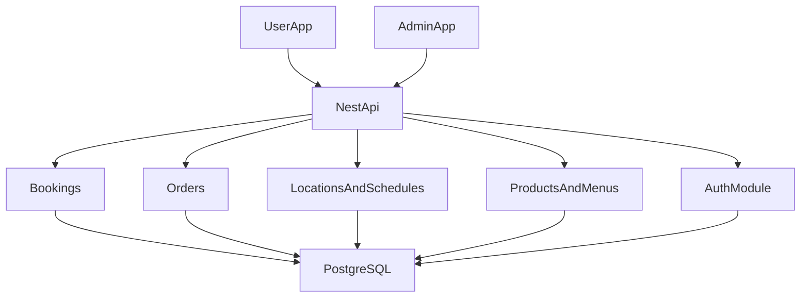

# Egypt Super App Architecture Plan

## Recommended Shape

Use one monorepo with three top-level apps:

- [apps/user-app](apps/user-app): Angular SSR + Capacitor for customers
- [apps/admin-app](apps/admin-app): Angular SSR for admins and vendors
- [apps/api](apps/api): NestJS backend used by both apps
- [libs/shared-types](libs/shared-types): shared DTO/type contracts
- [libs/shared-auth](libs/shared-auth): role enums, permission helpers, token payload types
- [libs/shared-ui](libs/shared-ui): shared frontend UI primitives, wrappers, and theme tokens for Tailwind + PrimeNG usage across both apps

This should start as a modular monolith, not microservices. Your markdown describes multiple backend domains, but at MVP stage they should be NestJS modules inside one API so you avoid distributed-system complexity too early.

Do not use microfrontends for either frontend at this stage. Keep each frontend as one deployable app, and split it internally using feature libraries, lazy-loaded routes, and shared UI/data-access libraries.

## Why This Fits Your Plan

The same account can access both apps, so the core system should be centralized:

- One auth system
- One user/role model
- One vendor ownership model
- One bookings/orders engine
- One source of truth for locations, schedules, and products

Vendor access is best handled as RBAC plus data scoping:

- `admin`: full admin app access
- `vendor`: admin app access limited to owned locations/products/bookings/orders
- `user`: user app access only

## Suggested Backend Modules

Inside [apps/api](apps/api), create NestJS modules in this order:

- `auth`: login, refresh, password reset, token guards
- `users`: profile, account data
- `roles`: role assignment and permission checks
- `vendors`: vendor profile and ownership mapping
- `categories`: restaurant, cafe, barber, football field, home service, store
- `locations`: branches/places with geo/address/category/vendor links
- `schedules`: working days, slots, holidays, capacity
- `products`: products, menus, extras, availability windows
- `bookings`: reservation flow, capacity checks, booking lifecycle
- `orders`: optional order attached to booking or standalone store order later
- `notifications`: in-app/push notification records

## Core Data Model

Start with PostgreSQL and keep the schema normalized:

- `users`
- `roles`
- `user_roles`
- `vendors`
- `vendor_users`
- `categories`
- `locations`
- `location_schedules`
- `products`
- `product_categories`
- `location_products`
- `bookings`
- `booking_items`
- `orders`
- `order_items`
- `notifications`

Important modeling choice:

- Treat the booking and optional order as related but separate aggregates.
- `bookings` should store reservation details.
- `orders` should reference `booking_id` when the user adds items during booking.
- This keeps restaurant/barber/field booking logic flexible while still supporting menu items and extras.

## Frontend App Boundaries

For [apps/user-app](apps/user-app):

- Authentication
- Home/categories/search
- Place details
- Booking flow
- Optional order flow
- Cart/checkout for booking-linked orders
- Orders/bookings history
- Profile/notifications

Implementation approach for [apps/user-app](apps/user-app):

- One Angular SSR app, not microfrontends
- Capacitor added for Android/iOS packaging
- Internal feature libraries such as `libs/user/feature-home`, `libs/user/feature-booking`, `libs/user/feature-orders`, and `libs/user/data-access`
- Lazy-loaded routes for major domains instead of independently deployed frontend modules

For [apps/admin-app](apps/admin-app):

- Dashboard
- Categories
- Vendors
- Locations
- Schedules
- Products/Menus
- Bookings
- Orders
- Users
- Settings

Vendor mode should be the same app as admin, but with route guards and filtered data.
Do not build a third vendor frontend unless the product later demands a different UX.

Implementation approach for [apps/admin-app](apps/admin-app):

- One Angular SSR app, not microfrontends (no Capacitor unless you later add a native admin shell)
- Domain feature libraries such as `libs/admin/feature-dashboard`, `libs/admin/feature-locations`, `libs/admin/feature-products`, and `libs/admin/data-access`
- Shared UI patterns through `libs/shared-ui` so both frontends keep a consistent component layer

## Delivery Phases

### Phase 1: Foundation

- Create monorepo structure and shared libraries
- Create NestJS auth, users, roles modules
- Add PostgreSQL, migrations, and seed roles
- Scaffold both frontends as Angular SSR apps; add Capacitor only to the user app
- Set up Tailwind CSS and PrimeNG in both frontend apps with a shared theming approach
- Implement login and role-aware routing

### Phase 2: Marketplace Setup

- Admin app creates categories, vendors, locations, schedules
- Admin/vendor create products and assign them to locations
- Expose public location/product listing APIs for the user app

### Phase 3: Booking MVP

- User app browses places and available slots
- User creates booking
- Backend enforces slot capacity and status lifecycle
- Admin/vendor view and manage bookings

### Phase 4: Optional Order With Booking

- Add `Would you like to order?` step in booking flow
- Fetch products valid for selected location and time
- Create order linked to booking
- Show combined confirmation and status tracking

### Phase 5: Operations

- Notifications
- Revenue/reporting basics
- Payment integration after flows are stable

## Recommended Technical Decisions

- Monorepo tool: Nx is a strong fit because Angular + NestJS work well together
- Frontend architecture: modular monolith frontends with feature libraries, not microfrontends
- Both frontends: Angular SSR enabled (server-side rendering for initial HTML and universal patterns)
- User app: Angular SSR + Capacitor for native builds
- Admin app: Angular SSR only (typically deployed as a Node SSR host; auth-gated, SEO less critical than user app but same rendering model)
- UI stack: Tailwind CSS for layout/utility styling and PrimeNG for component foundations in both frontends
- UI composition rule: use PrimeNG as the base component library, then standardize spacing, layout, and visual rules through Tailwind and `libs/shared-ui`
- Frontend state: keep simple initially with Angular services/signals; add NgRx only if complexity proves it necessary
- Auth: JWT access token + refresh token, backend-enforced RBAC
- API style: REST first, documented with Swagger/OpenAPI
- Database: PostgreSQL
- File storage: object storage later for location/product images

## Request Flow

## First Implementation Slice

Build the smallest end-to-end slice before broad admin features:

1. Login with roles
2. Admin creates category, vendor, location, and schedule
3. Admin/vendor creates products for a location
4. User views location details and available slots
5. User creates booking
6. User optionally adds items and confirms order+booking
7. Admin/vendor sees the result in bookings/orders screens

That slice will validate almost every major architectural assumption in your markdown before you spend time on dashboards, analytics, or settings.
